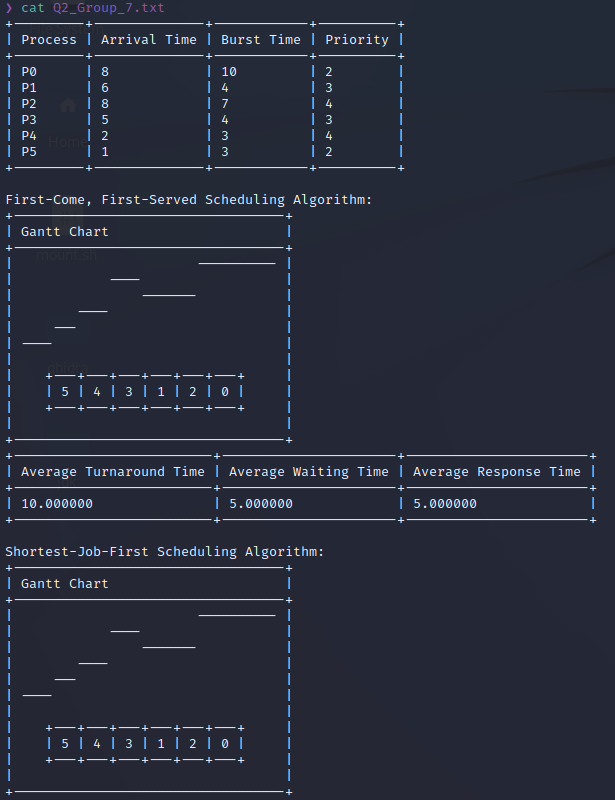

# Qn 2

## Usage

1. Compile and run main binary

```shell
make
```

2. Clean directory

```shell
make clean
```

## Details

1. Running the program, the user is prompted to select a process scheduling algorithm.

    

2. After the user specifies a process scheduling algorithm, the user is prompted whether to generate process attributes randomly, or manually.

    1. In the case of generating process attributes randomly, the process attribute table is printed as follows.

        

    2. In the case of inputting process attributes manually, the user is prompted for integer values for each process, for arrival time, burst time and priority. The process attribute table is then printed to show the inputted arrival times, burst times and priorities.

        

3. After the user selects a process scheduling algorithm, the program runs the specified process scheduling algorithm first, before running all other process scheduling algorithms.

4. After running all process scheduling algorithms, their individual gantt charts, process execution orders and average turnaround times, average waiting times, average response times are printed. Finally, all the process scheduling algorithms' average times are compared, and the process scheduling algorithms with the shortest average turnaround time, shortest waiting time and shortest response time are printed.

    

5. The program output is saved to a text file

    
